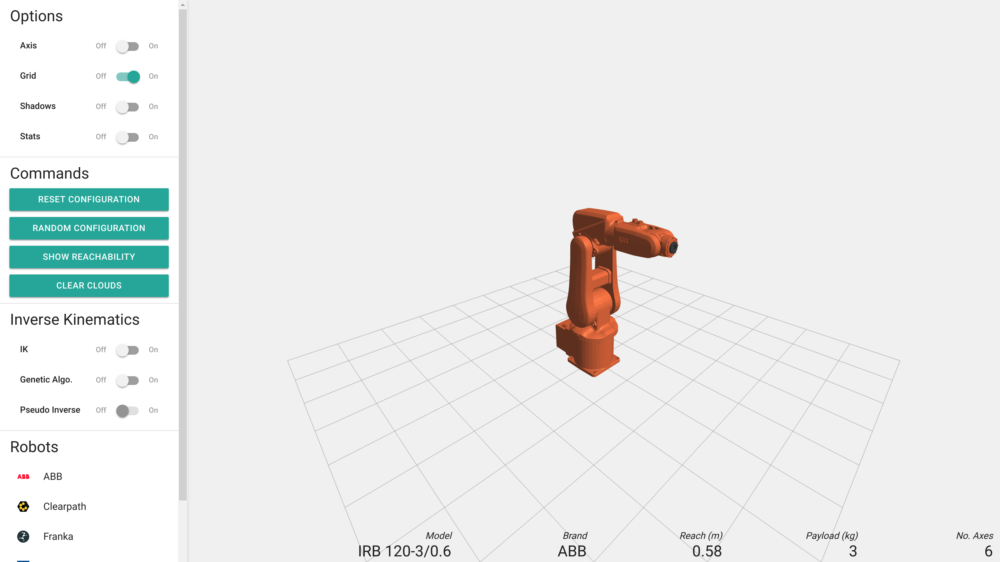
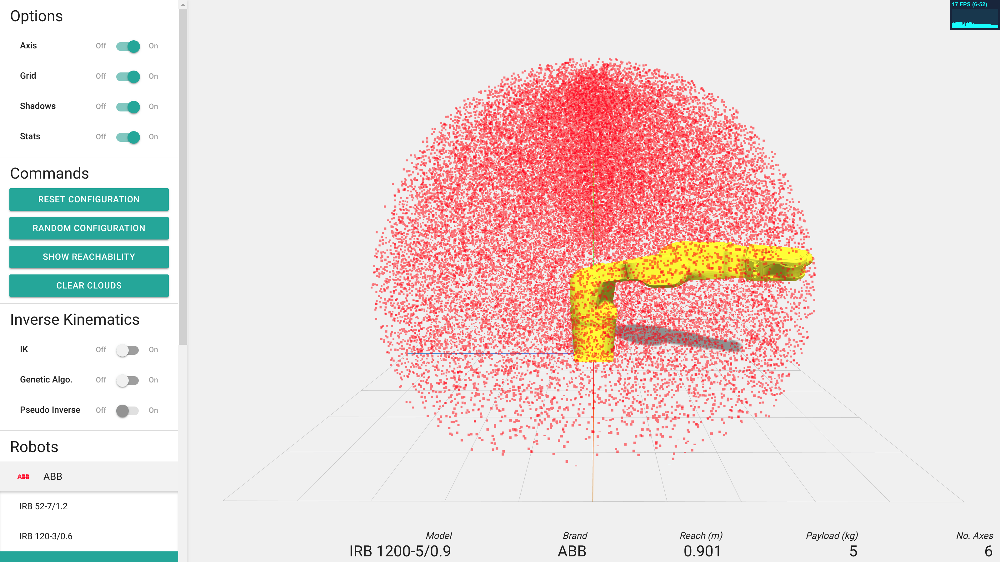
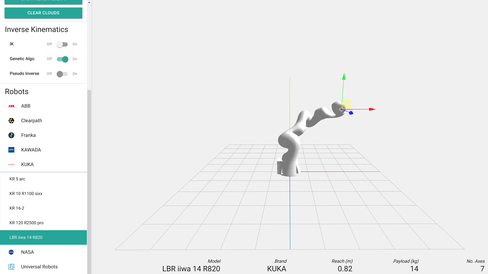
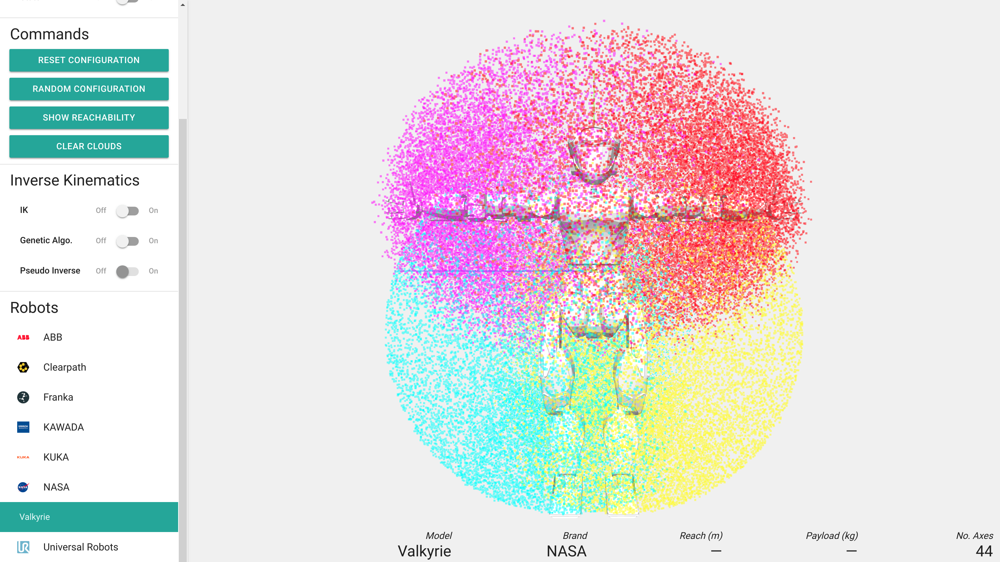

# Robot Viewer

Interactive 3D web application for visualizing and manipulating robot models with real-time forward and inverse kinematics.

Browse 81+ robots from 35+ brands, loaded as URDF models from a [dedicated model repository](https://github.com/ferrolho/robot-viewer-models). Features include IK solvers, velocity/force ellipsoid visualization, reachability point clouds, and motion keypoint recording.

> **Note:** The screenshots below show an older version of the UI. The current interface features a dual-sidebar layout with a brand gallery, dark/light theme, and i18n support.

`Figure 1 - The application as is on startup.`


`Figure 2 - Axis, Grid, Shadows, and Stats options active.`


`Figure 3 - Using Inverse Kinematics to position the KUKA LBR iiwa robot.`


`Figure 4 - The reachability of the NASA Valkyrie humanoid robot with 44 degrees of freedom.`


## Features

- **Robot catalog** — 81+ URDF models from 35+ brands, organized in a two-level brand gallery with search and category filtering
- **Forward / Inverse Kinematics** — drag IK gizmos to pose end-effectors in real time (Pseudo Inverse solver); supports multi-tip robots
- **Ellipsoid visualization** — velocity and force manipulability ellipsoids at the end-effector
- **Reachability clouds** — sample random configurations to visualize the workspace
- **Motion keypoints** — record, play back, and export convex hulls as STL
- **Dark / Light theme** — persisted in localStorage
- **Internationalization** — English, Japanese, and Chinese (Simplified), with a dropdown language picker

## Keyboard Shortcuts

| Key | Action |
|-----|--------|
| `?` | Show keyboard shortcuts dialog |
| `T` | IK gizmo: translate mode |
| `R` | IK gizmo: rotate mode |
| `Q` | Toggle local / world frame |
| `K` | Record motion keypoint |
| `P` | Play recorded keypoints |
| `C` | Clear motion keypoints |
| `X` | Export convex hull as STL |

## Development

```bash
npm install
npm run dev        # Vite dev server with HMR
npm run build      # Production build → dist/
npm run lint       # ESLint
npm run typecheck  # TypeScript type checking
```

## Tech Stack

Three.js, urdf-loader, mathjs, @tweenjs/tween.js, TypeScript, Vite.

## Known Limitations

- **Genetic Algorithm** IK solver is slow and causes interface lag; Pseudo Inverse is the recommended solver
- **Analytical IK** (via `kinematics` package) is disabled — requires extracting DH-like geometry from URDF joint origins (not yet implemented)
