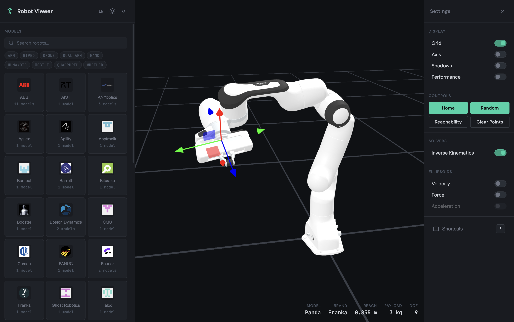
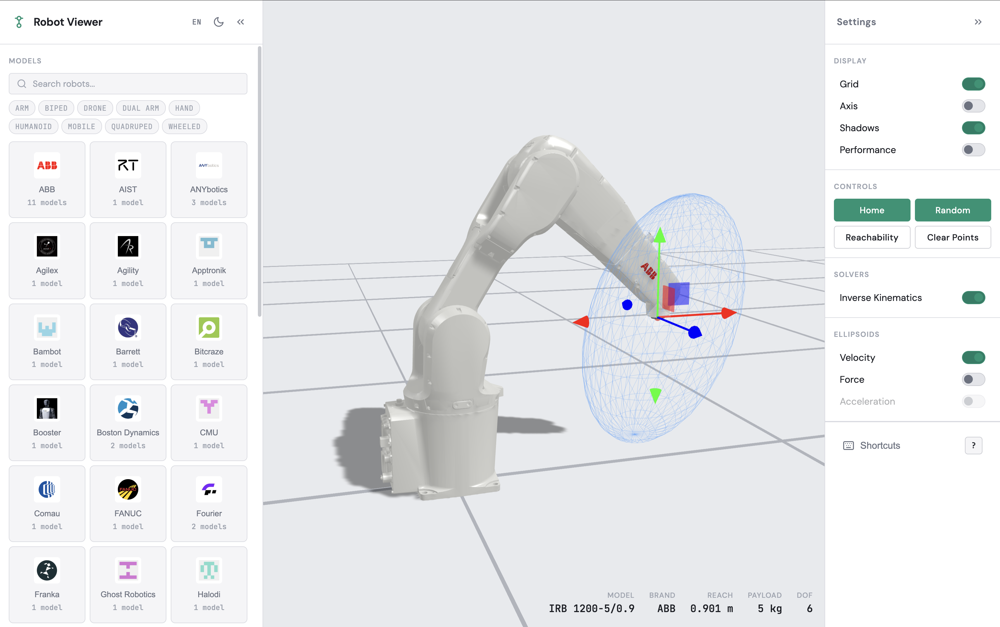
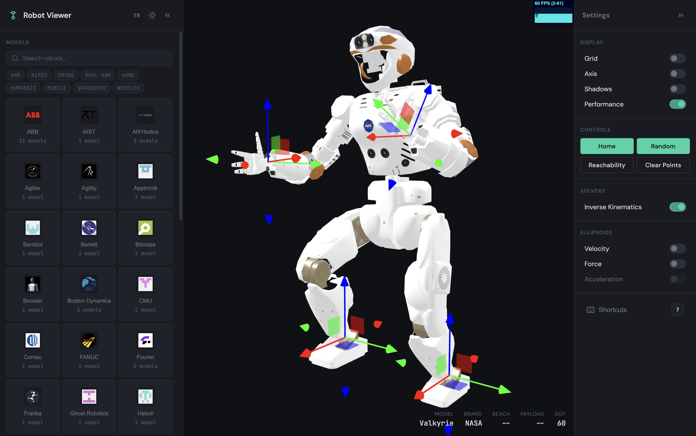
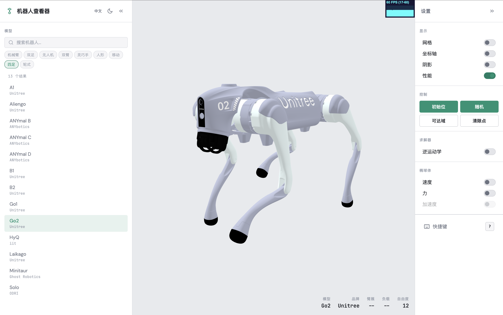

# Robot Explorer

Interactive 3D web application for visualizing and manipulating robot models with real-time forward and inverse kinematics.

Browse 81+ robots from 35+ brands, loaded as URDF models from a [dedicated model repository](https://github.com/ferrolho/robot-explorer-models). Features include IK solvers, manipulability ellipsoids, force polytopes, reachability point clouds, and motion keypoint recording.

## Features

- **Robot catalog** — 81+ URDF models from 35+ brands, organized in a two-level brand gallery with search and category filtering
- **Forward / Inverse Kinematics** — drag IK gizmos to pose end-effectors in real time (Pseudo Inverse solver); supports multi-tip robots
- **Manipulability ellipsoids** — velocity, acceleration, and force ellipsoids at the end-effector, computed from the Jacobian and joint-space inertia matrix
- **Force polytopes** — visualize the achievable force set at the end-effector using URDF effort limits
- **Capability info modal** — mathematical background for each visualization tier, rendered with KaTeX
- **Auto-frame camera** — automatically frames the camera on the loaded robot using precomputed viewbox data
- **Center of mass** — visualize the robot's center of mass from URDF inertial data
- **Reachability clouds** — sample random configurations to visualize the workspace
- **Motion keypoints** — record, play back, and export convex hulls as STL
- **Dark / Light theme** — persisted in localStorage
- **Internationalization** — English, Japanese, and Chinese (Simplified), with a dropdown language picker

## Keyboard Shortcuts

| Key | Action |
|-----|--------|
| `?` | Show keyboard shortcuts dialog |
| `T` | IK gizmo: translate mode |
| `R` | IK gizmo: rotate mode |
| `Q` | Toggle local / world frame |
| `K` | Record motion keypoint |
| `P` | Play recorded keypoints |
| `C` | Clear motion keypoints |
| `X` | Export convex hull as STL |

## Development

```bash
npm install
npm run dev        # Vite dev server with HMR
npm run build      # Production build → dist/
npm run lint       # ESLint
npm run typecheck  # TypeScript type checking
```

## Tech Stack

Three.js, urdf-loader, KaTeX, @tweenjs/tween.js, TypeScript, Vite.

## Screenshots

**Inverse Kinematics** — Franka Panda with IK gizmo (dark theme)


**Velocity Ellipsoid** — ABB IRB 1200 with manipulability ellipsoid (light theme)


**Multi-tip IK** — NASA Valkyrie humanoid with 60 DOF and per-limb IK targets


**Internationalization** — Chinese (Simplified) locale with Unitree Go2 quadruped (light theme)


